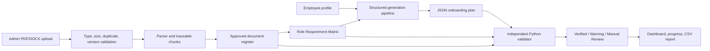
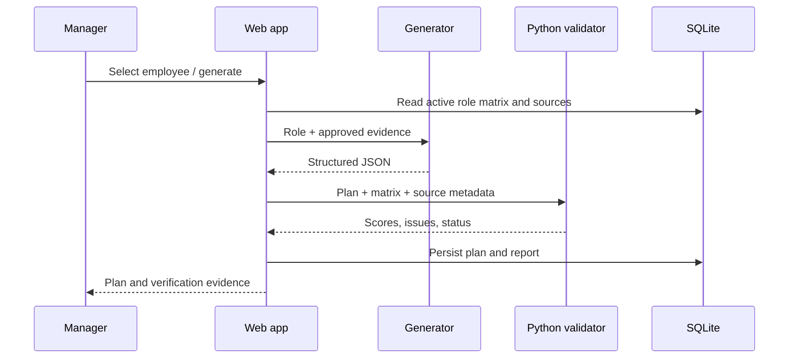

# SkillSprint AI Project Report

## Architecture and data flow

## Core use case

An authorized administrator uploads a company policy, confirms its metadata, and approves it. A manager selects an employee. Generation returns JSON containing requirements, stages, sources, quiz source mappings and rubrics. Validation compares attributes - never exact prose - against the active matrix. The plan is released only with its resulting verification status.

## Sequence

## Test checklist

| Test | Expected result |
|---|---|
| PDF/DOCX upload | Stored, chunked and set Pending Review |
| Unsupported extension | HTTP 400 |
| Duplicate title/version | HTTP 409 |
| Prompt injection phrase | Flagged as data |
| Obsolete source | Manual Review Required |
| Missing mandatory requirement | Coverage below 100 |
| Generated seed plan | Verified and 100% traceable |
| CSV export | Plan validation evidence downloads |
